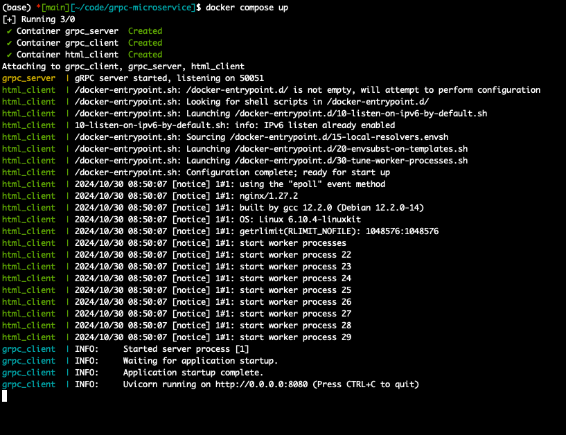
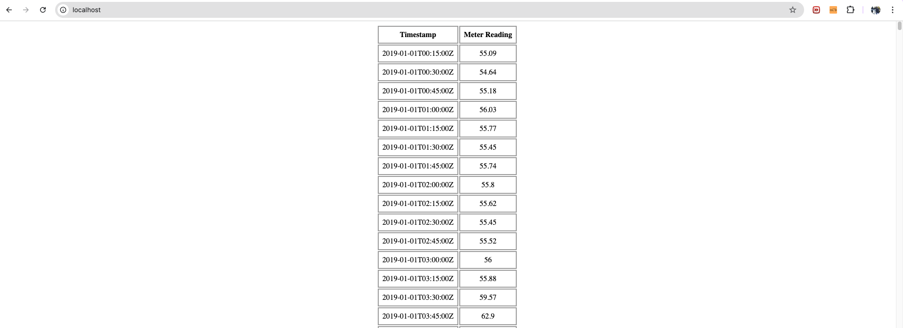

# Introduction
The repository contains 3 services that has to be run in parallel:

1. gRPC server      - Implemented in Python 
2. gRPC client      - Implemented in Python using FastAPI
3. HTML client (UI) - Plain HTML file as specified

Docker is used here to package the respective services and Docker Compose is
used to enable the 3 services to be run on the same host with different ports.

# Steps to run the 3 microservices

1. Ensure docker is set up locally
2. Clone the repository
3. At the root of the repository, run `docker compose up`
4. Terminal Status
    - 
5. Visit [http://localhost:80/](http://localhost:80/)
    - 

# Rationale behind a few decisions 
1. FastAPI over Django/Flask
    - Needed something lightweight (Django is heavy with many inbuilt modules that are not necessary for this assignment)
    - Needed a framework with good documentation (Flask's documentation is subpar to what FastAPI has come up with)

2. Usage of Pydantic (having a models folder to define a data structure)
    - gRPC allows us to define function parameters and types, which is great for
    consistentcy across different services on a network level, but it does not
    provide data validation that could be crucial and necessary for application
    logic and further processing. Pydantic helps with that.
    - IDE linting and jumping across definitions sort of support that could be
    very important for developers 

3. Usage of Docker
    - Docker is the gold standard for getting applications to run on peoples'
    machine in the most convenient way possible. Having Docker Hub makes it much
    easier for people to forgo setting up respective environments, since they
    essentially just have to pull the images to run.
    - Using docker-compose would also allow one to run 3 different services on
    the same host without needing different terminal sessions / tmux sessions.
    
4. Usage of 'Single-Request-Stream-Response' function among the 4 type of gRPC methods
    - In our case, we have a csv file with multitudes of the same data type
    (timestamp & float). This calls for a function that could yield these
    results once they are ready. As opposed to a CSV file, a live system would
    have just a meter that is churning out these values at a fast rate. This
    calls for the need to 'stream' as opposed to sending values in bulk.

# Additional To-dos
1. Since the images are hosted on docker-hub, it is possible to spin up container service on AWS to have a live website without the need to run anything locally.
2. Better error-handling during the read from the excel sheet, since there could be irrational values. Right now, I am skipping values that could be wrong, but this could be better written.
3. 